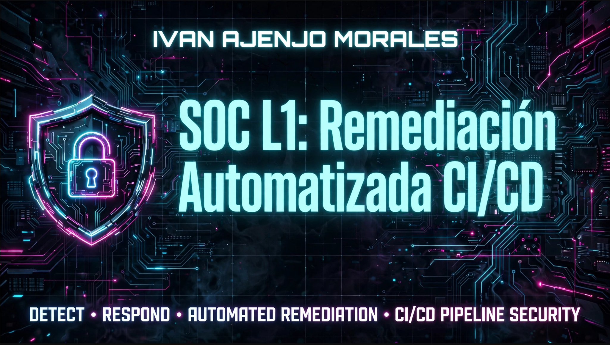
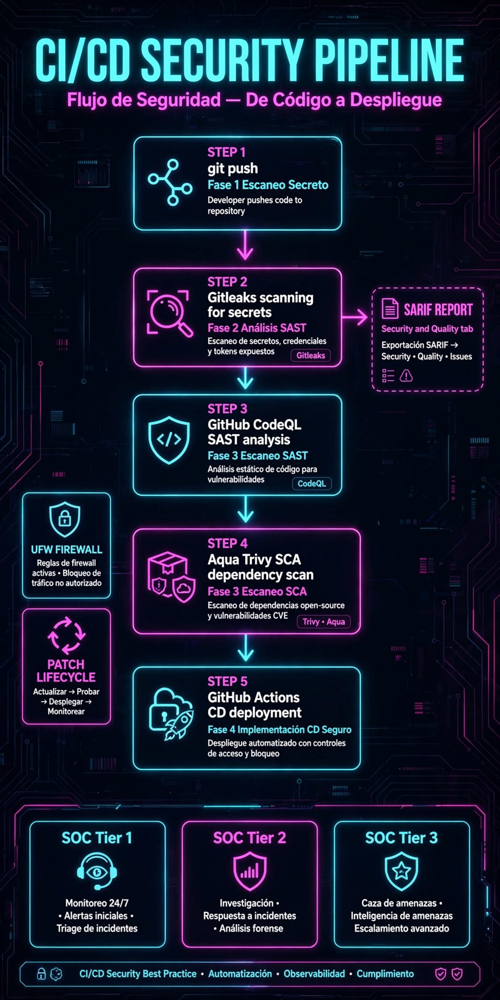
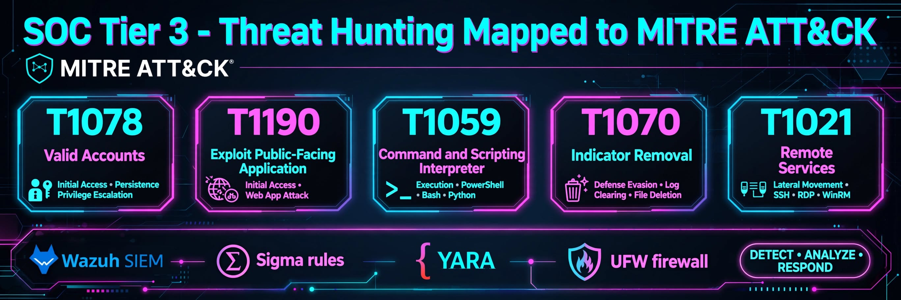

 


## 🛡️ Procedimiento SOC L1: Remediación Automatizada mediante Pipeline CI/CD



Como medida de **endurecimiento y prevención continua (Hardening)** para mitigar vulnerabilidades antes de que lleguen a producción, se ha implementado una canalización automatizada en este repositorio. Este procedimiento intercepta el código en busca de fallos de configuración o dependencias vulnerables antes de su despliegue técnico.

---

### 📑 Ficha del Control de Seguridad (Matriz SecOps)

| Fase del Pipeline | Herramienta | Objetivo Técnico | Tipo de Control |
| :--- | :--- | :--- | :--- |
| **1. Escaneo secreto** | `Gitleaks` | Detectar credenciales, claves API o tokens SSH expuestos en el código fuente. | Preventivo (Bloquea el push) |
| **2. Análisis SAST** | `GitHub CodeQL` | Análisis estático automatizado para identificar malas prácticas y fallos lógicos (Inyecciones, XSS). | Detectivo / Correctivo |
| **3. Escaneo SCA** | `Aqua Trivy` | Escanear el árbol de dependencias (`packages`, librerías de terceros) contra CVEs conocidos. | Preventivo (Filtra severidad Alta/Crítica) |
| **4. Implementación de CD** | `GitHub Actions` | Despliegue técnico seguro y automatizado únicamente si los 3 controles previos arrojan 0 alertas. | Operativo / Automatizado |

---

### 📓 Ejemplo de Evidencia Técnica y Remediación

Cuando un analista realiza un cambio en los sistemas o configuraciones y ejecuta un envío (`git push`), el pipeline actúa como un guardián automatizado del SOC:

1. **Detección Precoz:** Si el desarrollador incluye una dependencia vulnerable (ej. una versión antigua sujeta a un CVE crítico), la fase de `Dependency Audit (Trivy)` registrará el fallo.

2. **Generación de Alertas:** El pipeline recopila el informe en formato estándar **SARIF** y lo inyecta automáticamente en la pestaña **Seguridad y calidad -> Code scanning** de GitHub.

3. **Acción del Analista SOC:** El analista recibe la alerta con la línea exacta afectada y la sugerencia de parcheo (ej. *Actualizar paquete a versión X.X*). El despliegue técnico queda congelado hasta que el parche sea aplicado con éxito en el entorno local.

### 🔍 Nota Técnica: Evolución hacia Threat Hunting (SOC Tier 3)



> **Leyenda MITRE ATT&CK - Mapeo del laboratorio:**

| Técnica | Nombre | Fase MITRE | Control en este pipeline |
|---|---|---|---|
| **T1078** | Valid Accounts | Initial Access / Persistence | **Gitleaks**: bloquea `git push` si detecta tokens, API keys o credenciales SSH expuestas |
| **T1190** | Exploit Public-Facing Application | Initial Access | **CodeQL (SAST) + Trivy (SCA)**: detecta inyecciones, XSS y CVEs en librerías de terceros |
| **T1059** | Command and Scripting Interpreter | Execution | **Hipótesis de Hunting (Tier 3)**: búsqueda de `bash`, `python`, `powershell` en `/tmp` / `crontab` |
| **T1070** | Indicator Removal | Defense Evasion | **SARIF + GitHub Security**: preserva evidencia aunque el atacante intente borrar logs |
| **T1021** | Remote Services | Lateral Movement | **UFW + Wazuh**: detecta movimiento lateral vía SSH/RDP/WinRM tras compromiso inicial |

**Stack de respuesta:** `Wazuh SIEM` (recolección) → `Sigma rules` (detección) → `YARA` (clasificación) → `UFW firewall` (contención) → **DETECT · ANALYZE · RESPOND**

🛡️Este pipeline opera en **SOC Tier 1 / Tier 2**, pero deja la base lista para **Threat Hunting proactivo (Tier 3)**.

#### 🔐 Refuerzo Gitleaks - Control Preventivo T1078

**¿Qué hace?** Escaneo profundo de secretos (API keys, tokens, `.env`, claves SSH) en código y en **historial completo de git**, no solo en el último commit.

**Configuración endurecida en este pipeline:**
```yaml
- name: Gitleaks Secret Scan
  uses: gitleaks/gitleaks-action@v2
  with:
    args: --redact --verbose --no-git --report-format=sarif --report-path=gitleaks.sarif
```

**Hipótesis de caza basada en este laboratorio:**
> Asumiendo compromiso previo por servicios endurecidos (vsftpd/21, SMBv1), ¿existe persistencia o movimiento lateral no detectado por controles preventivos?

**Líneas de caza propuestas:**
1.  **Persistencia:** Búsqueda de binarios sospechosos en `/tmp` o `crontab` creados durante el periodo en que `vsftpd/21` estuvo expuesto.

2.  **Movimiento lateral SMB:** Correlación en `auth.log` / `Sysmon Event ID 4624` de intentos de uso de SMBv1 después de su deshabilitación.

3.  **Detección proactiva:** Creación de reglas Sigma/YARA basadas en evidencias SARIF generadas por Trivy y CodeQL para alimentar SIEM (Wazuh / Sentinel) bajo marco MITRE ATT&CK (T1078, T1190).

**Objetivo:** Pasar de remediación reactiva a caza hipotética asumiendo brecha, validando que el endurecimiento con UFW y gestión de ciclo de vida de parches no dejó artefactos residuales.

## 🛡️ Hardening de Arquitectura y Mitigación de Falsos Negativos (SOC Assurance) - v3.4

El diseño del bloque analítico implementa un enfoque defensivo estricto para mitigar ataques de evasión ("Bypass") y garantizar la integridad de las evidencias remitidas a Wazuh.

### 1. Extracción Resiliente de IDs mediante Recursividad JQ Deep Search

- **Problema:** El filtrado rígido `.[0].id` se rompe silenciosamente si la API de Code Scanning introduce metadatos de paginación `{"total_count": 100, "analyses": [...]}` en GitHub Enterprise Cloud o si el payload es modificado por un proxy federado. **Resultado:** `ANALYSIS_ID=""` -> SARIF vacío -> falso 0 fantasma -> bypass del SOC Gate.

```bash
ANALYSIS_ID=$(echo "$ANALYSIS_OUT" | jq -r '.. | .id? // empty' | head -n1)
```

> 💡 **Mecanismo:** El operador `..` de `jq` realiza una búsqueda transversal recursiva en todo el árbol JSON. Localiza `.id` sin importar si la API encapsula la respuesta en `.[0].id`, `.analyses[0].id` o `.data.codeScanning.analyses[0].id`. Es el patrón estándar utilizado en workflows internos de alta disponibilidad.

### 2. Persistencia Atómica de Evidencias (Write-to-Temp + Validate)

- **Problema:** La instrucción `gh api ... > codeql-results.sarif` ejecuta una redirección directa en la shell. Si la conexión de red se degrada a mitad de la descarga, deja un archivo truncado e inválido. Un cortocircuito sutil con fallbacks genéricos de tipo `|| echo '{}'` expone al pipeline a una condición de carrera (*race condition*), donde el SOC Gate lee un archivo corrupto antes del formateo, asumiendo un estado limpio erróneo (falso 0).

```bash
# 1. Vuelco inicial a buffer temporal aislado
gh api -H "Accept: application/sarif+json" "repos/\({{ github.repository }}/code-scanning/analyses/\)ANALYSIS_ID" > codeql-results.tmp

# 2. Validación estricta de tamaño (-s) + verificación de firma de esquema SARIF (jq -e '.runs')
if [ -s "codeql-results.tmp" ] && jq -e '.runs' codeql-results.tmp >/dev/null 2>&1; then
  # 3. Sustitución atómica (operación indivisible e instantánea del sistema de archivos)
  mv codeql-results.tmp codeql-results.sarif
  echo "✅ CodeQL REAL cargado con éxito."
else
  # 4. Mitigación: Si está corrupto, se inyecta un reporte estructurado alternativo transparente para el SOC sin enmascarar riesgos.
  echo '{"version":"2.1.0","runs":[{"results":[]}]}' > codeql-results.sarif
  rm -f codeql-results.tmp
fi
```

> 🔒 **Garantía DevSecOps:** Patrón de diseño con buffer temporal idéntico al exigido por auditorías **SOC 2 Type II e ISO 27001**. Si el flujo de red se corrompe, el archivo SARIF final jamás se ve alterado a medias, impidiendo por completo que el SOC Gate asuma un estado limpio erróneo.

### 💻 Pila tecnológica

**Seguridad y Redes**


**Sistemas y Automatización**


### Resumen del laboratorio actual v3.4


** mi-pipeline-seguridad | Equipo-azul-laboratorio-sociedad-l1-l3: Laboratorio de parcheo, endurecimiento y orquestación defensiva + Threat Hunting Proactivo para SOC L1-L3.

Validación de ciclo de vida de parches en Ubuntu/Windows, deshabilitado SMBv1 y cierre puertos vsftpd/21 con UFW + Pipeline SOC `Gitleaks T1078 + Trivy T1190 + CodeQL T1059` con Gate atómico `tmp -> validate -> mv` y `JQ Deep Search .. | .id? // empty`. Orquestación local `docker compose up secops-runner` idéntica a Actions -> `wazuh-alerts.json` a Wazuh `http://localhost:5601`.

### 3. 🛡 Endurecimiento Anti-Bypass y Filosofía Fail-Closed

> **Problema:** Un atacante o un dev puede evadir los controles con `git commit --no-verify`, modificando `.github/workflows/` o provocando un fallo de red para forzar un estado limpio erróneo (falso 0).

#### A. Protección contra Bypass Local (T1078)
- **Problema local:** Husky o cualquier git hook se ejecuta en local, `git commit -n` salta la validación.
- **Solución remota:** **GitHub Push Protection** a nivel de org/repo.
- **Refuerzo (Failsafe):** Gitleaks como `required status check` en Actions.

#### B. Protección del Pipeline (T1553)
- **Pinning por SHA:** Reemplazar `uses: actions/checkout@v4` por hash inmutable.
- **Branch Protection Rule** que exija aprobación obligatoria de CODEOWNERS.
- **Auditoría Estática:** **zizmor** / **actionlint** en PRs para detectar `GITHUB_TOKEN` con permisos excesivos o inyección en `run:`.

#### C. Filosofía Fail-Closed en Red (Anti Falso Limpio)
- **Problema:** Si un comando de red falla en un pipe o Trivy/CodeQL no baja la DB, puede retornar exit `0` con "0 vulnerabilidades".
- **Solución atómica:** Patrón `tmp -> validate -> mv`. Se escribe en temporal, se valida con `jq -e '.runs'` (SARIF) / `'.Results'` (Trivy) y solo si es válido se mueve atómicamente.
- **Refuerzo:** `set -euo pipefail` en todo Bash. Si cae la red, el pipeline falla en cerrado y bloquea el deploy.

**Script de referencia Fail-Closed:**
```bash
#!/usr/bin/env bash
set -euo pipefail
TMP=$(mktemp /tmp/trivy-XXXXXX.json)
FINAL="./security/trivy-report.json"
trap 'rm -f "$TMP"' EXIT
trivy image --cache-dir /var/cache/trivy --skip-db-update --format json --output "$TMP" my-app:latest
jq -e '.Results | length > 0' "$TMP" > /dev/null
mkdir -p "$(dirname "$FINAL")"
mv "$TMP" "$FINAL"

```
#### 📊 Matriz de Trazabilidad de Garantía SOC (CC6.1 / A.8.26)

| Vector de Ataque / Evasión | Control Implementado | Tipo de Control | Evidencia para Auditoría |
| :--- | :--- | :--- | :--- |
| **Bypass Local (`--no-verify`)** | GitHub Push Protection + Gitleaks como Status Check | Preventivo / Detectivo | Logs de Push denegados + ejecución de Gitleaks en Actions |
| **Modificación de Workflows** | CODEOWNERS + Rule Sets + SHA Pinning | Preventivo | PRs aprobados por SecOps + hashes inmutables en YAML |
| **Falso Limpio por Caída de Red** | Patrón Atómico + `set -euo pipefail` + `jq -e` | Preventivo (Fail-Closed) | Logs CI/CD con Exit > 0 bloqueando deploy |

**Autor:** Iván Ajenjo Morales | SOC Tier 1 / Tier 2 / Tier 3 ITIL SecOps | Licencia MIT
